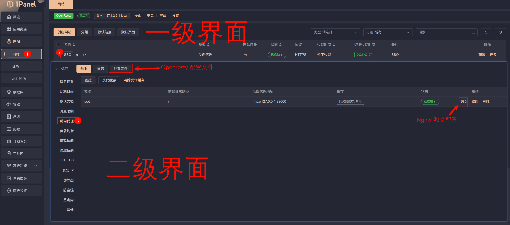

# Docker Compose 库

> [!IMPORTANT]
> 本库重度依赖 1Panel 面板  
> 为了减少工作量与迁移成本，会尽可能的把配置写入到 .env 文件中，一次编辑终身使用！

在未额外声明的情况下，默认使用 1Panel 面板管理，Nginx 为面板默认的 Openresty；Docker 网络使用 `proxy`

```bash
docker network create proxy
```

---

> [!NOTE]
> 为了减少歧义，本库中涉及的术语定义如下

## 术语定义

### Openresty 配置文件

指在 1Panel 面板中，点击 `网页` 后状态栏中的 `配置文件`

### Nginx 源文配置

指在 1Panel 面板的 `反向代理` 设置中的 `源文`

#### 图例


