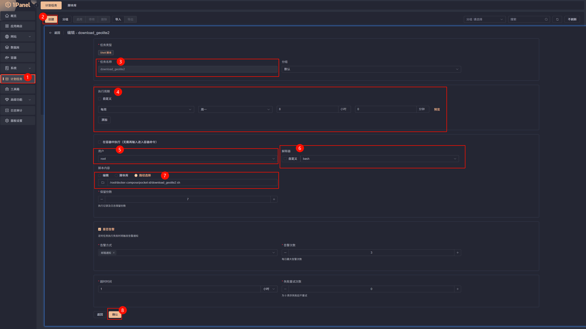
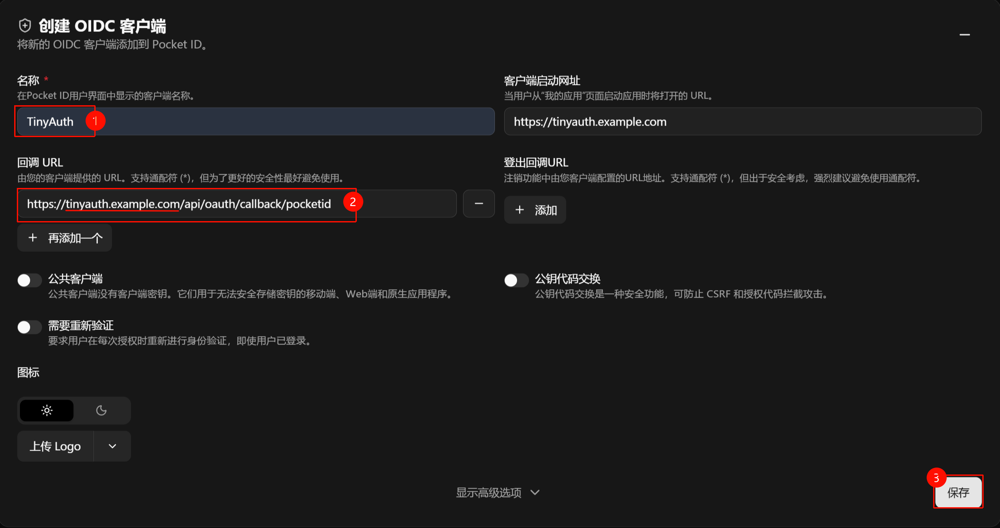

# TinyAuth + PocketID

本文将介绍如何依托 1Panel 使用 PocketID + TinyAuth 聚合容器并与 Openresty 整合，来实现 SSO 鉴权。

## 1. 部署 PocketID + TinyAuth

```bash
mkdir TinyAuth&PocketID && cd TinyAuth&PocketID

wget "https://raw.githubusercontent.com/NEANC/PKB/master/Docker-Compose/TinyAuth&PocketID/docker-compose.yml" 
wget "https://raw.githubusercontent.com/NEANC/PKB/master/Docker-Compose/TinyAuth&PocketID/.tinyauth-env" 
wget "https://raw.githubusercontent.com/NEANC/PKB/master/Docker-Compose/TinyAuth&PocketID/.pocketid-env"

nano docker-compose.yml  # 根据注释修改配置
nano .tinyauth-env  #根据注释修改配置
nano .pocketid-env  #根据注释修改配置

docker compose up -d
```

## 2. 配置 PocketID

### 2.1 注册 Root 账户

访问 `https://pocketid.your.domain/setup` 并注册 ROOT 账户

### 2.2 PocketID 反向代理设置

#### 2.2.1 Openresty 配置文件

向 `server` 块中，添加以下内容：

```nginx
proxy_busy_buffers_size   512k;
proxy_buffers   4 512k;
proxy_buffer_size   256k;
```

#### 完整示例

```nginx
server {
    listen 443 ssl;
    略

    proxy_busy_buffers_size   512k;
    proxy_buffers   4 512k;
    proxy_buffer_size   256k;

    略
    include /www/sites/vaultwarden/proxy/*.conf; 
}
```

#### 2.2.2 Nginx 源文配置

使用默认

### 3. 使用脚本添加 GeoLite2-City.mmdb

在 TinyAuth&PocketID 目录下运行

```bash
wget "https://raw.githubusercontent.com/NEANC/PKB/master/Docker-Compose/TinyAuth&PocketID/PocketID/download_GeoLite2-City.mmdb.sh"

# 更改脚本中的目标目录为 pocketid_data，若更改了 docker-compose.yml 中的 volumes 映射，请更改成对应目录
sed -i 's/TARGET_DIR="${SCRIPT_DIR}\/data"/TARGET_DIR="${SCRIPT_DIR}\/pocketid_data"/g' download_GeoLite2-City.mmdb.sh

chmod +x download_GeoLite2-City.mmdb.sh

./download_GeoLite2-City.mmdb.sh
```

### 4.1 使用 1Panel 设置计划任务



---

## 5. 为 TinyAuth 配置 PocketID OIDC 客户端

> [!IMPORTANT]
> 请注意 令牌 URL 和 `用户信息 URL` 的地址由于使用了 Docker 内部网络，所以可以用 `http://pocketid:1411`，而不是 `https://pocketid.your.domain`

新建一个 OIDC 客户端，随后将客户端 ID 和 密钥、令牌 URL、回调 URL、等填入到 TinyAuth 的 `.tinyauth-env` 文件中



回调 URL 需与 `.tinyauth-env` 中的回调 URL 一致：  
`https://tinyauth.example.com/api/oauth/callback/pocketid`

## 6. TinyAuth 反向代理设置

TinyAuth 的 Openresty 配置文件 与 Nginx 源文配置 使用默认即可

### 6.1 需要做保护的 Nginx 源文配置

<details open>
<summary>
📌 点击本行即可折叠下列内容
</summary>

```nginx
location ^~ / {
    proxy_pass http://127.0.0.1:22267;

    # tinyauth 前置鉴权
    auth_request /_tinyauth_check;
    error_page 401 = @tinyauth_login;

    # 将用户信息传递给后端（如果 tinyauth 有返回用户信息）
    auth_request_set $ta_user $upstream_http_remote_user;
    proxy_set_header Remote-User $ta_user;

    proxy_set_header Host $host;
    proxy_set_header X-Real-IP $remote_addr;
    proxy_set_header X-Forwarded-For $proxy_add_x_forwarded_for;
    proxy_set_header REMOTE-HOST $remote_addr;
    proxy_set_header Upgrade $http_upgrade;
    proxy_set_header Connection $http_connection;
    # 强制覆盖转发给后端的Connection头，防止某些后端不支持WebSocket时出现问题
    # proxy_set_header Connection "upgrade";
    proxy_set_header X-Forwarded-Proto $scheme;
    proxy_set_header X-Forwarded-Port $server_port;
    proxy_http_version 1.1;
    add_header X-Cache $upstream_cache_status;
    add_header Cache-Control no-cache;
    proxy_ssl_server_name off;
    proxy_ssl_name $proxy_host;
}

# 子请求：调用 tinyauth 检查登录
location = /_tinyauth_check {
    internal;
    # tinyauth 的地址
    proxy_pass http://127.0.0.1:3000/api/auth/nginx;
    proxy_set_header x-forwarded-proto $scheme;
    proxy_set_header x-forwarded-host  $host;
    proxy_set_header x-forwarded-uri   $request_uri;
}

# 如果未登录，跳转到 tinyauth 登录页
# 将 tinyauth.example.com 替换为自托管的 tinyauth 的外部访问地址
location @tinyauth_login {
    return 302 https://tinyauth.example.com/login?redirect_uri=$scheme://$host$request_uri;
}
```

</details>

此时访问这个网页，会自动跳转到 Tinyauth ，完成登录后会自动跳转回来，注意由于 Cookie 保存的位置是当前根目录，所以请使用同一根目录的子域名部署被保护网页和 TinyAuth。
