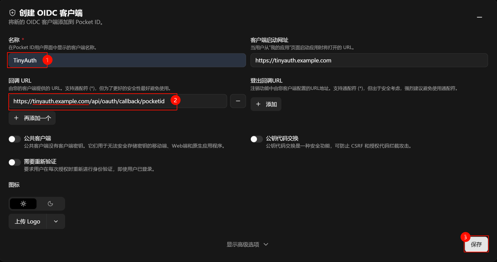

# TinyAuth + PocketID

> [!NOTE]
> 时间戳  
> 完成编写并完成测试 - 2025.12.31

本文将介绍如何依托 1Panel 使用 PocketID + TinyAuth 并与 Openresty 整合，来实现 SSO 鉴权。

## 1. 部署 TinyAuth

```bash
mkdir tinyauth
cd tinyauth

wget https://raw.githubusercontent.com/NEANC/PKB/main/TinyAuth/docker-compose.yml
wget https://raw.githubusercontent.com/NEANC/PKB/main/TinyAuth/.env

nano docker-compose.yml  # 根据注释修改配置
nano .env  #根据注释修改配置

docker compose up -d
```

## 2. 配置 PocketID

新建一个 OIDC 客户端，随后将客户端 ID 和 密钥、令牌 URL、回调 URL、等填入到 TinyAuth 的 `.env` 文件中



回调 URL 需与 `.env` 中的回调 URL 一致：  
`https://tinyauth.example.com/api/oauth/callback/pocketid`

## 3. 反向代理设置

TinyAuth 的 Openresty 配置文件 与 Nginx 源文配置 使用默认即可

### 3.1 需要做保护的 Nginx 源文配置

<details open>
<summary>
📌 点击本行即可折叠下列内容
</summary>

```nginx
location ^~ / {
    proxy_pass http://127.0.0.1:22267;

    # tinyauth 前置鉴权
    auth_request /_tinyauth_check;
    error_page 401 = @tinyauth_login;

    # 将用户信息传递给后端（如果 tinyauth 有返回用户信息）
    auth_request_set $ta_user $upstream_http_remote_user;
    proxy_set_header Remote-User $ta_user;

    proxy_set_header Host $host;
    proxy_set_header X-Real-IP $remote_addr;
    proxy_set_header X-Forwarded-For $proxy_add_x_forwarded_for;
    proxy_set_header REMOTE-HOST $remote_addr;
    proxy_set_header Upgrade $http_upgrade;
    proxy_set_header Connection $http_connection;
    # 强制覆盖转发给后端的Connection头，防止某些后端不支持WebSocket时出现问题
    # proxy_set_header Connection "upgrade";
    proxy_set_header X-Forwarded-Proto $scheme;
    proxy_set_header X-Forwarded-Port $server_port;
    proxy_http_version 1.1;
    add_header X-Cache $upstream_cache_status;
    add_header Cache-Control no-cache;
    proxy_ssl_server_name off;
    proxy_ssl_name $proxy_host;
}

# 子请求：调用 tinyauth 检查登录
location = /_tinyauth_check {
    internal;
    # tinyauth 的地址
    proxy_pass http://127.0.0.1:3000/api/auth/nginx;
    proxy_set_header x-forwarded-proto $scheme;
    proxy_set_header x-forwarded-host  $host;
    proxy_set_header x-forwarded-uri   $request_uri;
}

# 如果未登录，跳转到 tinyauth 登录页
# 将 tinyauth.example.com 替换为自托管的 tinyauth 的外部访问地址
location @tinyauth_login {
    return 302 https://tinyauth.example.com/login?redirect_uri=$scheme://$host$request_uri;
}
```

</details>

此时访问这个网页，会自动跳转到 Tinyauth ，完成登录后会自动跳转回来，注意由于 Cookie 保存的位置是当前根目录，所以请使用同一根目录的子域名部署被保护网页和 TinyAuth。

## 参考链接

- [TinyAuth Wiki](https://tinyauth.app/docs/about)
- JimsGarage 的[油兔视频](https://youtu.be/qmlHirOpzpc?si=l0HcIUJYtlLS9MnH)和 [compose.yaml](https://github.com/JamesTurland/JimsGarage/blob/main/Tinyauth/docker-compose.yaml)
- [IT-Connect - Florian](https://www.it-connect.fr/tinyauth-traefik-ajoutez-un-portail-authentification-a-vos-applications-web/)
- [使用 TinyAuth 实现任意应用登录认证 | LiuShen'sBlog](https://blog.liushen.fun/posts/362bfd8b/#%E4%BD%BF%E7%94%A8)
- [使用 TinyAuth 和 Traefik 实现简单的认证代理 - Skyone Blog](https://blog.skyone.dev/2023/traefik-docker-gateway/)
- [自托管部署 Pocket ID 与 Tinyauth 完全指南 | Dejavu's Blog](https://blog.dejavu.moe/posts/build-passkeys-identity-system-with-pocketid-x-tinyauth/)
