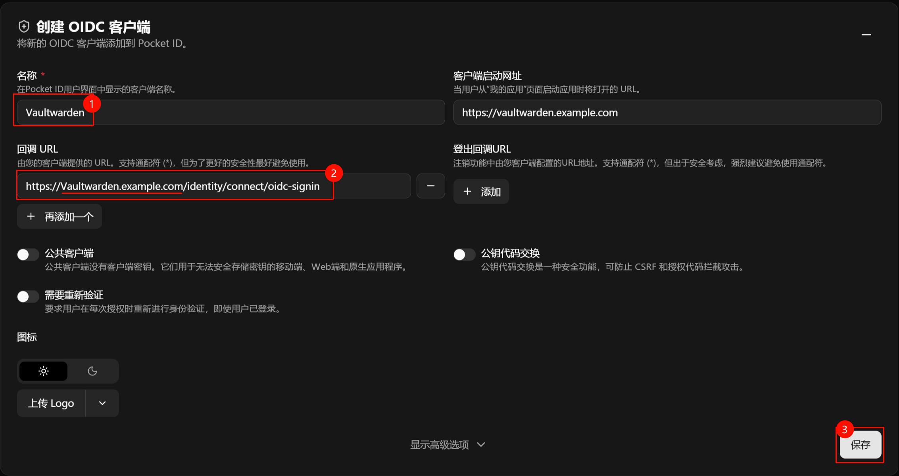

# Vaultwarden

Vaultwarden 密码管理器，并可通过 PocketID 实现 SSO 鉴权

## 1. 部署 Vaultwarden

```bash
mkdir Vaultwarden
cd Vaultwarden

wget https://raw.githubusercontent.com/NEANC/PKB/main/Docker-Compose/Vaultwarden/docker-compose.yml
wget https://raw.githubusercontent.com/NEANC/PKB/main/Docker-Compose/Vaultwarden/.env

# 若不使用 SSO，请使用 nosso.env 文件
wget https://raw.githubusercontent.com/NEANC/PKB/main/Docker-Compose/Vaultwarden/nosso.env
cp sso.env .env # 重命名为 .env 文件

nano docker-compose.yml  # 根据注释修改配置
nano .env  #根据注释修改配置

docker compose up -d
```

## 2. 配置 SSO 登陆

> [!CAUTION]
> 设置 SSO 登陆也依旧会要求输入主密码来解密密码库，这是 [Bitwarden 加密策略](https://bitwarden.com/help/using-sso/#tab-master-password-5SgfI0t7yucjtl8qLjp4Y1)要求的，可以等待实现 Vaultwarden [可信设备](https://bitwarden.com/help/add-a-trusted-device/)

在 PocketID 中新建一个 OIDC 客户端，随后将客户端 ID 和 密钥 填入到 Vaultwarden 的 `.env` 文件中



回调 URL `https://vaultwarden.example.com/identity/connect/oidc-signin`

## 3. 反向代理设置

### 3.1 Openresty 配置文件

#### 3.1.1 在 `server` 块前，添加以下内容

> [!IMPORTANT]
> 请根据你的实际端口修改下面的端口号  
> 若不需要 websocket 支持，可以省略相关配置

```nginx
# 'upstream' 指令确保你有一个 http/1.1 连接
# 设置内部别名，即上游点
# 启用 keepalive 选项并拥有更好的性能
# 此处定义服务器的 IP 和端口。
upstream @vaultwarden {
  zone @vaultwarden 64k;
  server 127.0.0.1:51666; # 修改这个IP地址
  keepalive 10;
}

# 允许 websocket 连接
# 参阅：https://nginx.org/en/docs/http/websocket.html
map $http_upgrade $connection_upgrade {
    default upgrade;
    ''      close;
}

```

#### 3.1.2 在 `server` 块中，添加以下内容

```nginx
# 封堵 /admin 路径，提升安全性
location = /admin {
    return 404;
}

client_max_body_size 525M;        # 设置最大上传文件大小
ssl_session_tickets off;          # 禁用 TLS 会话票证（Session Tickets）功能
```

#### 完整示例

```nginx
# 此处定义服务器的 IP 和端口。
upstream @vaultwarden {
  zone @vaultwarden 64k;
  server 127.0.0.1:56666; # 修改这个IP地址
  keepalive 10;
}

# 激活 websocket 连接
map $http_upgrade $connection_upgrade {
    default upgrade;
    ''      close;
}

server {
    listen 443 ssl;
    略

    location = /admin {
        return 404;
    }
    client_max_body_size 525M;
    ssl_session_tickets off;

    略
    include /www/sites/vaultwarden/proxy/*.conf;
}
```

---

### 3.2 Nginx 源文配置

```nginx
location ^~ / {
    proxy_pass http://@vaultwarden; # 无需修改，使用了上方的 upstream 映射
    proxy_set_header Host $host;
    proxy_set_header X-Real-IP $remote_addr;
    proxy_set_header X-Forwarded-For $proxy_add_x_forwarded_for;
    proxy_set_header REMOTE-HOST $remote_addr;
    proxy_set_header Upgrade $http_upgrade;
    # 强制覆盖转发给后端的Connection头，防止某些后端不支持WebSocket时出现问题
    # proxy_set_header Connection $http_connection;
    # 实现普通 HTTP 请求和 Websocket 请求的动态适配
    proxy_set_header Connection $connection_upgrade;
    proxy_set_header X-Forwarded-Proto $scheme;
    proxy_set_header X-Forwarded-Port $server_port;
    proxy_http_version 1.1;
    add_header X-Cache $upstream_cache_status;
    add_header Cache-Control no-cache;
    proxy_ssl_server_name off;
    proxy_ssl_name $proxy_host;
    proxy_set_header Connection "upgrade";

    proxy_buffering off;        # 禁用缓存
    proxy_connect_timeout 30s;  # Nginx连接后端的超时设置
    proxy_read_timeout 28800;   # 设置后端返回超时时间，8小时
    proxy_send_timeout 28800;   # 设置请求超时时间，8小时
}

location ~ ^/notifications/hub.*$ {
    proxy_pass http://@vaultwarden; # 无需修改，使用了上方的 upstream 映射
    proxy_set_header Host $host;
    proxy_set_header X-Real-IP $remote_addr;
    proxy_set_header X-Forwarded-For $proxy_add_x_forwarded_for;
    proxy_set_header X-Forwarded-Proto $scheme;
    proxy_http_version 1.1;
    proxy_set_header Upgrade $http_upgrade;
    # 强制覆盖转发给后端的Connection头，防止某些后端不支持WebSocket时出现问题
    # proxy_set_header Connection $http_connection;
    # 实现普通 HTTP 请求和 Websocket 请求的动态适配
    proxy_set_header Connection $connection_upgrade;

    proxy_buffering off;        # 禁用缓存
    proxy_connect_timeout 30s;  # Nginx连接后端的超时设置
    proxy_read_timeout 28800;   # 设置后端返回超时时间，8小时
    proxy_send_timeout 28800;   # 设置请求超时时间，8小时
}
```

## 参考链接

- [Vaultwarden wiki](https://github.com/dani-garcia/vaultwarden/wiki/)
- [Vaultwarden 第三方中文 wiki](https://rs.ppgg.in/)
- [Vaultwarden 讨论#6292](https://github.com/dani-garcia/vaultwarden/discussions/6292)
- [CSDN 问答 - Vaultwarden Nginx 配置中如何正确设置 WebSocket 支持？](https://ask.csdn.net/questions/9051684/56034800)
