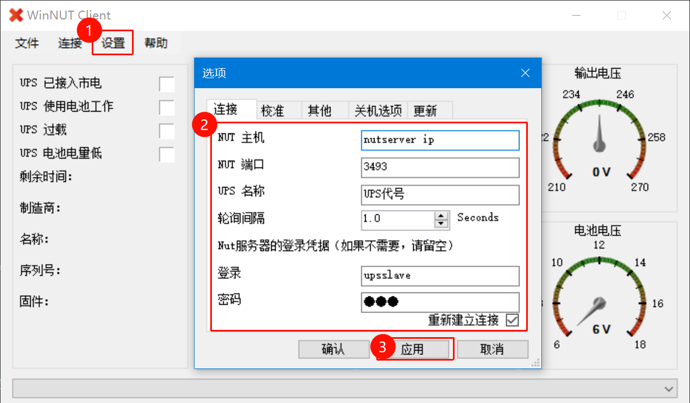
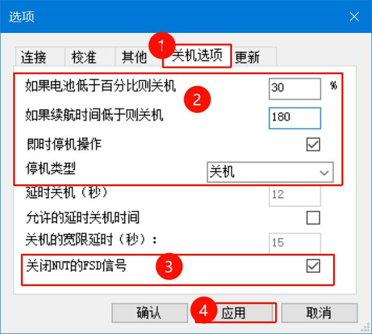
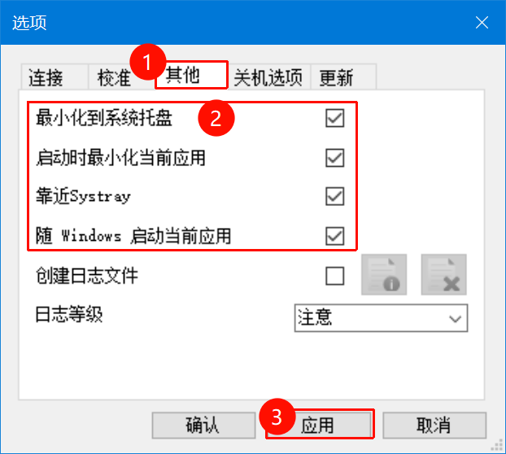
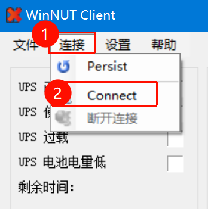
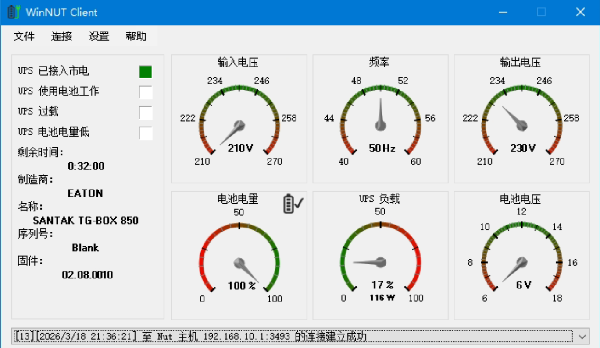

# 在 PVE 中配置 NUT 服务器

在 PVE 中配置 NUT Server ，并在电池电量低时通过 ServerChan 发送通知，并通过 WinNUT-Client 与 WINDOWS 集成。

## 准备工作

### 1. 安装 nut

```bash
apt update && apt install nut -y
```

### 2. 使用 nut 获取设备信息

```bash
nut-scanner -U
```

### 3. 检查 USB 设备

```bash
lsusb
```

---

## 配置 NUT

### 1. 设置运行模式

```bash
nano /etc/nut/nut.conf

MODE=netserver
# standalone - 单机模式、netserver - 服务端、netclient - 客户端
```

### 2. 配置 UPS 硬件

```bash
nano /etc/nut/ups.conf

pollinterval = 5

[ups代号]
driver                           = "usbhid-ups"
port                             = "auto"
vendorid                         = "通过 nut-scanner -U 获取"
vendor                           = "通过 nut-scanner -U 获取"
productid                        = "通过 nut-scanner -U 获取"
product                          = "通过 nut-scanner -U 获取"
serial                           = "通过 nut-scanner -U 获取"
bus                              = "通过 nut-scanner -U 获取"
# 电池状态下保持运行时间
override.battery.runtime.low     = "300"
# 低电量阈值（百分比）
override.x.additional.lowbatt    = "30"
override.x.additional.devicetype = "USB"
```

### 3. 配置服务端监听（upsd.conf）

```bash
nano /etc/nut/upsd.conf

LISTEN 0.0.0.0 3493
MAXAGE 15
```

### 4. 配置用户权限（upsd.users）

```bash
nano /etc/nut/upsd.users

# PVE 本地主用户
[upsmaster]
password = 密码
upsmon master
actions = SET
instcmds = ALL

# 其他服务器从用户（仅监控）
[upsslave]
password = 密码
upsmon slave
```

### 5. 配置本地监控

```bash
nano /etc/nut/upsmon.conf

RUN_AS_USER root
MONITOR ups代号@localhost 1 upsmon 密码 master
MINSUPPLIES 1
SHUTDOWNCMD "/sbin/shutdown -h +0"
NOTIFYCMD /usr/sbin/upssched
POLLFREQ 2
POLLFREQALERT 1
HOSTSYNC 15
DEADTIME 15
POWERDOWNFLAG /etc/killpower

# 指定通知执行的脚本
NOTIFYCMD /etc/nut/ups_notify.sh

# 触发通知（SYSLOG+WALL+EXEC）
NOTIFYFLAG ONLINE   SYSLOG+WALL+EXEC
NOTIFYFLAG ONBATT   SYSLOG+WALL+EXEC
NOTIFYFLAG LOWBATT  SYSLOG+WALL+EXEC
NOTIFYFLAG FSD      SYSLOG+WALL+EXEC
NOTIFYFLAG SHUTDOWN SYSLOG+WALL+EXEC
```

### 6. 配置 ServerChan 通知脚本

```bash
wget https://raw.githubusercontent.com/NEANC/PKB/main/NUT/ups_notify.sh

nano /usr/local/bin/ups_notify.sh

sudo chmod +x /etc/nut/ups_notify.sh
sudo chown root:root /etc/nut/ups_notify.sh
```

### 7. 启动并验证服务

```bash
# 重启 NUT 服务并设置开机自启
sudo systemctl restart nut-server nut-monitor
sudo systemctl enable nut-server nut-monitor

# 验证启用状态
sudo systemctl is-enabled nut-server
sudo systemctl is-enabled nut-monitor

# 验证运行状态
upsc ups代号@localhost
```

### 8. 验证

断电测试，查看是否收到 ServerChan 通知，并检查 PVE 是否正确执行了关机命令。

---

## 附录

## WINDOWS Client

下载并安装 [WinNUT-Client](https://github.com/nutdotnet/WinNUT-Client/releases)

### 链接设置

在 设置 -> 选项 -> 链接 中填写对应内容

| 选项     | 填写内容 | 备注                                                    |
| -------- | -------- | ------------------------------------------------------- |
| NUT 主机 | PVE IP   | 略                                                      |
| NUT 端口 | 3493     | 若未改过，则默认为 3493，在 `/etc/nut/upsd.conf` 中修改 |
| UPS 名称 | ups代号  | 在 `/etc/nut/ups.conf` 中设置的 ups 代号                |
| 登录     | upsslave | 在 `/etc/nut/upsd.users` 中设置的用户名                 |
| 密码     | 略       | 在 `/etc/nut/upsd.users` 中设置的密码                   |



### 关机选项设置

在 设置 -> 选项 -> 关机选项 中填写对应内容，若无法理解请直接参照截图设置

| 选项                               | 填写内容  | 备注                                                          |
| ---------------------------------- | --------- | ------------------------------------------------------------- |
| 如果电池低于百分比则关机           | 30        | 应 ≥ `/etc/nut/ups.conf` 中的 `override.x.additional.lowbatt` |
| 如果续航时间低于则关机即时停机操作 | 180       | 应 > `/etc/nut/ups.conf` 中的`override.battery.runtime.low`   |
| 停机类型                           | 关机/休眠 | 按需选择                                                      |
| 即时停机操作                       | 可选      | 当触发关机时，直接执行关机，与 `延时关机（秒）` 互斥          |
| 延时关机（秒）                     | 60        | 当触发关机时，延迟多少秒后再执行关机，与 `即时停机操作` 互斥  |
| 关闭NUT的FSD信号                   | 必选      | 强制关机信号                                                  |



### 其他设置

在 设置 -> 选项 -> 其他 中如图勾选，日志文件可选



### 链接

点击 链接 -> Connect ，如图：



### 成功链接

若成功链接，则显示如下：



---

## FnOS 添加 ServerChan 通知脚本

修改 `/etc/nut/upsmon.conf` 文件，添加 `NOTIFYCMD` 配置项：

```bash
nano /etc/nut/upsmon.conf

# 指定通知执行的脚本
NOTIFYCMD /etc/nut/ups_notify.sh
```

添加 `ups_notify.sh` 脚本：

```bash
wget https://raw.githubusercontent.com/NEANC/PKB/main/NUT/ups_notify.sh

nano /usr/local/bin/ups_notify.sh

sudo chmod +x /etc/nut/ups_notify.sh
sudo chown root:root /etc/nut/ups_notify.sh

sudo systemctl restart nut-server nut-monitor
```
