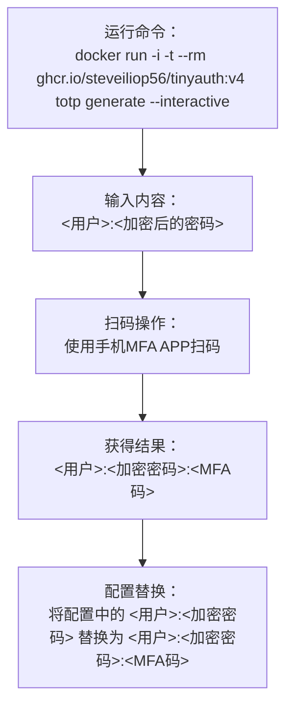

# 在 1Panel 中部署 TinyAuth 并与 Openresty 结合实现 SSO 鉴权

## 1. 部署 TinyAuth

```bash
git clone https://github.com/steveiliop56/tinyauth.git
cd tinyauth
nano docker-compose.yml # 根据注释修改配置文件
nano .env  # 根据注释修改
nano users  # 用户管理，格式为 <用户名>:<加密后的密码>

docker compose up -d
```

## 2. 如何在 1Panel 中与 Openresty 使用


1. 在 1Panel 后台，选择需要保护的应用，进入 `反向代理` 设置页面
2. 创建一个新的反向代理，名称为 `sso`
3. 设置反代地址，例如 `http://127.0.0.1:8082`
4. 设置前端请求路径为 `/manifest.json`，保存
5. 关闭默认的反向代理，避免后续步骤出错
6. 点击 `源文` 编辑 Nginx 配置
7. 保存

此时访问这个应用的地址，会自动跳转到 tinyauth 地址，实现登录后会自动跳转回来，注意由于 Cookie 保存的位置是当前根目录，所以请使用同一根目录的子域名部署被保护应用和 TinyAuth。

### 2.1 Nginx 配置

<details open>
<summary>
📌 点击本行即可折叠下列内容
</summary>

```nginx
# ===============================
# 主应用反向代理 + 鉴权
# ===============================
# 静态资源直接放行（不鉴权）
location = /manifest.json {
    proxy_pass http://127.0.0.1:8082; # 被保护的主应用地址，也是反代地址
}

location = /favicon.ico {
    proxy_pass http://127.0.0.1:8082;
}

location ^~ /assets/ {
    proxy_pass http://127.0.0.1:8082;
}

# 其他请求需要鉴权
location ^~ / {
    proxy_pass http://127.0.0.1:8082;

    # ---------------------
    # tinyauth 前置鉴权
    auth_request /_tinyauth_check;
    error_page 401 = @tinyauth_login;

    # 将用户信息传递给后端（如果 tinyauth 有返回用户信息）
    auth_request_set $ta_user $upstream_http_remote_user;
    proxy_set_header Remote-User $ta_user;
    # ---------------------

    proxy_set_header Host $host;
    proxy_set_header X-Real-IP $remote_addr;
    proxy_set_header X-Forwarded-For $proxy_add_x_forwarded_for;
    proxy_set_header REMOTE-HOST $remote_addr;
    proxy_set_header Upgrade $http_upgrade;
    proxy_set_header Connection $http_connection;
    proxy_set_header X-Forwarded-Proto $scheme;
    proxy_set_header X-Forwarded-Port $server_port;
    proxy_http_version 1.1;
    add_header X-Cache $upstream_cache_status;
    add_header Cache-Control no-cache;
    proxy_ssl_server_name off;
    proxy_ssl_name $proxy_host;
}

# ===============================
# 子请求：调用 tinyauth 检查登录
# ===============================
location = /_tinyauth_check {
    internal;
    proxy_pass http://127.0.0.1:14389/api/auth/nginx;  # tinyauth 地址
    proxy_set_header x-forwarded-proto $scheme;
    proxy_set_header x-forwarded-host  $host;
    proxy_set_header x-forwarded-uri   $request_uri;
}

# ===============================
# 如果未登录，跳转到 tinyauth 登录页
# ===============================
location @tinyauth_login {
    return 302 https://sso.tinyauth.app/login?redirect_uri=$scheme://$host$request_uri;
    # 将 sso.tinyauth.app 替换为自托管的 tinyauth 的外部访问地址
}
```

</details>

## 可选. 多重因素认证（MFA/TOTP）

1. 在终端中运行

```bash
docker run -i -t --rm ghcr.io/steveiliop56/tinyauth:v4 totp generate --interactive
```

2. 将在 `users` / `.env` 内管理的账户选择要激活 MFA 的账号，完整复制粘贴（格式为：`<用户>:<加密后的密码>`）后回车

3. 生成一个密钥（格式为：<用户>:<加密后的密码>:<MFA 码>）和二维码，使用 `Google Authenticator` 或者 `Microsoft Authenticator` 等客户端扫描二维码，添加账号

4. 使用**新密钥**（格式为：`<用户>:<加密后的密码>:<MFA码>`）替换 **旧密钥**（格式为：`<用户>:<加密后的密码>`）

5. 保存配置文件，执行 `docker compose up -d` 重启服务

新密钥示例输出：

```bash
cmd/generate.go:119 > Add the totp secret to your authenticator app then use the verify command to ensure everything is working correctly. user=123:xxxxxxxxxxxxxxxxxx:yyyyyyyyyyyyyy
```

### 流程图



## 参考链接

- [TinyAuth Wiki](https://tinyauth.app/docs/about)
- JimsGarage 的[油兔视频](https://youtu.be/qmlHirOpzpc?si=l0HcIUJYtlLS9MnH)和 [compose.yaml](https://github.com/JamesTurland/JimsGarage/blob/main/Tinyauth/docker-compose.yaml)
- [IT-Connect - Florian](https://www.it-connect.fr/tinyauth-traefik-ajoutez-un-portail-authentification-a-vos-applications-web/)
- [使用 TinyAuth 实现任意应用登录认证| LiuShen'sBlog](https://blog.liushen.fun/posts/362bfd8b/#%E4%BD%BF%E7%94%A8)
